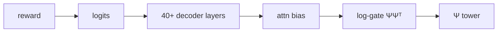
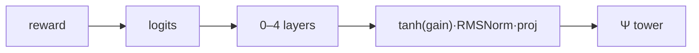
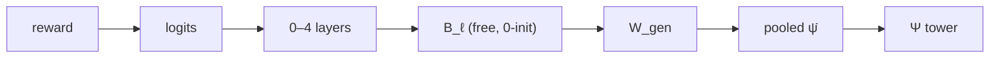
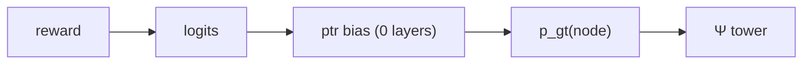
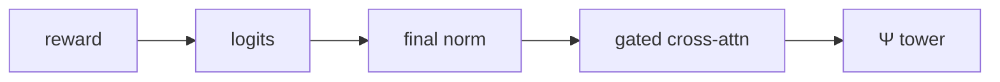

# e17 — Graph-conditioning architecture implementations (reference)

**Status: implementation reference for the e17 candidate fleet (2026-08-19).**
Covers the already-implemented pathways (mask baseline, candidate A) and the new
candidates D, E, C exactly as implemented. All candidates are **composable flags on
`learnable_graph_mask`** (`LearnableGraphMaskLLM`), share the same Ψ tower, and obey
the same two invariants:

1. **Zero-init ⇒ bitwise no-op.** Every pathway is gated so that a freshly-enabled,
   untrained pathway leaves logits bit-identical — pre-e17 SFT checkpoints
   (ai8c2bm0, 84% n30) warm-start unchanged and RL owns the pathway from step 0.
2. **fp32 tower contract.** Ψ and every fusion module compute in fp32; hooks cast to
   the hidden-state dtype at the read site.

## 0. The shared spine

Every candidate consumes the same per-node embedding **Ψ ∈ [N, d_gt]** from the
standalone Graph Transformer tower (e13f recipe: R-PEARL 5-layer GCN, 320 probes,
k_pe=3 → 3-layer sparse GT, 8 heads, d_model=1024, k_gt=2, warm-started from
`path_navigator_gt.pt`). What differs is **where Ψ enters the LLM** and therefore how
long the reward→tower gradient path is.

```
                  ┌────────────────────────────┐
   graph ────────►│  Ψ tower (R-PEARL → GT)    │──► Ψ [N, d_gt=1024]  (fp32)
                  └────────────────────────────┘
                        │        │        │        │
        ┌───────────────┘        │        │        └───────────────┐
        ▼                        ▼        ▼                        ▼
  [mask/baseline]           [A: pf]  [D: glora]              [E: pointer]
  attn-score bias           late-    per-graph ΔW            bias on lm_head
  ΨΨᵀ log-gate,             layer    on scoped               logits via
  all dense layers          resid    linears                 p_gt(node) + trie
        │                   write        │                        │
        ▼                        ▼        ▼                        ▼
 ┌─────────────────────────────────────────────────────────────────────────┐
 │  Gemma-4 31B decoder stack                                              │
 │  emb → L1 … L_k (sliding/global) … L_{n-K} … L_n → final norm → lm_head │
 │         ▲ mask bias (dense lyrs)      ▲ A,D (deep half)  ▲ C     ▲ E    │
 └─────────────────────────────────────────────────────────────────────────┘
                                                        [C: cross-attn]
                                                        h queries Ψ after L_n
```

Gradient-path length from reward (logits) back to the tower:

| candidate | reward → tower path | per-step decode state |
|---|---|---|
| mask (baseline) | logits → **40+ layers** → attn bias → ΨΨᵀ → tower | bias row per tagged step |
| A post_fusion | logits → **0–4 layers** → gated residual → proj → Ψ | ψ vector per tagged step |
| D graph_lora | logits → **0–4 layers** → B·A(ψ̄) → gen head → pooled Ψ | **none** (per-graph, static) |
| C cross_fusion | logits → final norm → **x-attn block** → Ψ | **none** (Ψ kv static) |
| E pointer_fusion | logits → **0 layers** (direct bias) → p_gt → Ψ | trie prefix state per step |

---

## 1. Baseline — `learnable_graph_mask` (e13/e16)

**Where:** inside self-attention, all dense (global-attention) layers.

```
M[i,j] = log(α + (1−α)·sim(Ψ_i, Ψ_j))   for adjacent node-token pairs (i,j)
M[i,j] = −∞                              non-adjacent node pairs (hard block)
M[i,j] = 0                               any pair involving a non-node token
```

The bias is added to the attention logits, i.e. a multiplicative gate on the
post-softmax weights. e13f runs use α=0, binary adjacency, cosine ΨΨᵀ,
`decode_consistent` injection. Decode-time: `MaskDecodeInjector` /
`BatchedMaskDecodeInjector` re-derive node-mention spans over the generated suffix
and arm a per-step bias row for query-tagged steps.

**e16 verdict:** RL-inert under every protocol (5 runs flat). The actuator moves
*where the model looks*, not *what it emits*, and the reward gradient crosses the
entire decoder stack before reaching the tower.



---

## 2. Candidate A — `post_fusion` (implemented, RL-validated)

**Where:** residual stream, deeper half of the global-attention layers
(`post_fusion_layer_scope=dense_top_half`), **node-token positions only**.

```
h[b, p, :] += tanh(pf_gain_ℓ) · RMSNorm( W_pf · Ψ[node(p)] )     W_pf: d_gt → hidden
```

- `pf_proj`/`pf_norm` **shared** across layers; one scalar gain per in-scope layer
  (`pf_gain`, zero-init ⇒ bitwise no-op).
- Positions = the QUERY-role injection-map spans — the single definition of "graph
  token" shared with the mask and identity-RoPE.
- Decode: the injector's row state tags query steps and arms `_pf_decode_vec`
  (`[B,1,hidden]`) with the same projected ψ row.
- Params: `pf_proj` ≈ d_gt·hidden ≈ 5.5M; trains at **base LR**
  (`base_lr_parameters()` — the structural 0.012 mult kept the gate shut in SFT).

**Status:** the first arch RL ever moved: 42.0 → 60.7% held-out n60
([rw7eg7b6](https://wandb.ai/alelab/GREP-PRISM/runs/rw7eg7b6)). SFT-inert (gate
opens ≤0.5%; the pathway exists for the reward, and teacher forcing doesn't need it).



---

## 3. Candidate D — `graph_lora` (graph-generated LoRA)

**Where:** the weights themselves — a hypernetwork LoRA on scoped target linears
whose **down-projection factor is emitted by the tower** per graph.

```
ψ̄ = mean_n Ψ_n                                  (pooled, [d_gt])
A(ψ̄) = reshape( W_gen · ψ̄ , [r, d_in] )         W_gen: d_gt → r·d_in   (per target type, shared across layers)
Δy   = B_ℓ · ( A(ψ̄) · x )                        B_ℓ: [d_out, r]  ZERO-INIT, per layer
y    = W_ℓ x + Δy
```

- The graph modulates the **computation** (a per-graph weight delta), not the
  activations: "this graph changes how you plan" as task conditioning.
- **No-op:** `B_ℓ = 0` at init ⇒ Δy ≡ 0 bitwise, with a live gradient
  (∂L/∂B = g_out·(A x)ᵀ ≠ 0) — no gate needed.
- v1 choices (from the design doc): per-graph pooled ψ̄ (not per-node — no routing
  story needed); generated factor = the **down-projection A** (cheapest head);
  targets = `o_proj` on `dense_top_half` layers; rank r=8.
- **Decode is trivial:** A(ψ̄) is constant per prompt — armed once per row at
  rollout/generation start (`_glora_A`: `[B, r, d_in]` per target type); no
  per-step state, no injector changes.
- Batched forward hook on each target linear:
  `y += einsum(x, A_b, B_ℓ)` per row; fp32 factors, cast at read.
- Params: `W_gen` = d_gt·r·d_in (o_proj d_in=hidden: ≈ 44M at r=8… see config to
  trade r down) + per-layer B = d_out·r (tiny). Trains at base LR.
- Risk (accepted, doc §3D): rank-r × pooled-ψ̄ is a narrow channel; if D
  underperforms A we learn the per-token routing matters.



---

## 4. Candidate E — `pointer_fusion` (GT node distribution → vocab bias)

**Where:** directly on the **lm_head logits** — the shortest possible path.

### 4.1 The mixture→logit-space design decision

The design sketch proposed a probability mixture
`p = (1−g)·p_llm + g·p_ptr` with a "zero-init ⇒ no-op" gate. That exact combination
is **mathematically impossible**: a smooth gate g ∈ [0,1] with g(0)=0 sits at the
boundary of its range, so every smooth parametrization has ∂g/∂θ = 0 at init (dead
gradient), and every kinked one (|tanh|, clamp, relu) has zero or undefined gradient
at exactly 0. You can have exact no-op or live gradient, not both, in mixture space.

In **logit space** the gate may be signed, so `tanh(gain)` (zero-init, slope 1)
gives both. v1 therefore implements E as a *structured logit bias* — candidate B's
actuator carrying candidate E's machinery (node distribution + spell trie):

```
score_n(t) = ( W_q h_t · Ψ_n ) / √d_gt                 W_q: hidden → d_gt
p_gt(n|t)  = softmax_n score_n(t)                       ◄─ the GT's node distribution
g_t        = σ( w_g · h_t + b_g )                       per-step consult gate
bias(tok,t)= Σ_n p_gt(n|t) · 1[tok ∈ next(n, s_t)]     spell-trie candidate mass
logits(tok,t) += tanh(ptr_gain) · ptr_scale · g_t · bias(tok,t)
```

- `next(n, s_t)`: the set of vocabulary tokens that would **start or continue** a
  spelling of node n's name given the current suffix state s_t — prefix matching
  over `node_token_variants` (the same tokenization variants the injectors use).
  A node's mass lands on its *next* token, so multi-token names work.
- **No-op:** `ptr_gain = 0` ⇒ bitwise unchanged logits; ∂/∂gain = scale·g·bias ≠ 0.
- **Gradient:** GRPO's advantage lands on p_gt with **zero intervening layers** —
  the shortest path of all candidates. (At init the tower's pointer-gradient is
  gated by tanh(0)=0, like A; RL opens the gain first.)
- **Interpretability:** log `g_t` and `p_gt` per step — when does the model consult
  the graph, and what does the graph want.

### 4.2 Mechanics

- Hook on `lm_head` (forward hook sees input h **and** output logits — one site
  serves teacher-forced loss, prefill, and cached decode uniformly).
- Teacher-forced/loss side: suffix states are recomputed by scanning the completion
  tokens (deterministic), giving per-position candidate sets; bias applied via
  sparse index-add. Armed like `_pf_signal` in `forward()`.
- Decode: `BatchedMaskDecodeInjector`/`MaskDecodeInjector` grow a per-row pointer
  suffix state on each step (same pre-hook that feeds the mask row state) and arm
  the per-step candidate set for the lm_head hook.
- Params: `W_q` ≈ hidden·d_gt ≈ 5.5M + gate vector; base LR.



---

## 5. Candidate C — `cross_fusion` (post-LLM cross-attention)

**Where:** one gated cross-attention block **after the last decoder layer** (before
the final norm): every position's hidden state queries the graph per decoding step.

```
q_t = W_q h_t          [hidden → d_x]          (d_x = d_gt = 1024, bottlenecked)
K   = W_k Ψ,  V = W_v Ψ  [d_gt → d_x]
u_t = W_o · MHA(q_t, K, V)   [d_x → hidden]     (8 heads, padded-N key mask)
h_t += tanh(xf_gain) · u_t
```

- This is the Flamingo-style "proper" post-fusion: unlike A (which only touches
  node-token positions with their *own* ψ), **every token can query every node**.
- Bottleneck d_x=1024 keeps the block ≈13M params (vs ~100M+ at full hidden width)
  — small enough to plausibly train under RL from the zero-init gate; the doc's
  "needs SFT first" concern applied to the full-width block. If the RL arm stays
  shut, the fallback is exactly that SFT warm-up.
- **No-op:** `xf_gain = 0` (zero-init) ⇒ bitwise; gradient live through tanh.
- **Decode is trivial:** K,V from Ψ are static per prompt — armed once per row
  (`[B, N_max, d_gt]` + padding mask); the block applies at every decode step with
  no per-step state.
- Implemented as a forward hook on the last decoder layer (handles both tensor and
  tuple returns); fp32 block, cast at read.



---

## 6. Shared plumbing (all new candidates)

| touchpoint | change |
|---|---|
| `gnn_llm.py` | `enable_graph_lora / enable_pointer_fusion / enable_cross_fusion` (callable post-hoc on warm-started checkpoints, mirroring `enable_post_fusion`); signal builders; hooks |
| `forward()` | arms each enabled pathway's signal from `graphs`/`injection_maps` |
| `base_lr_parameters()` | returns all fresh fusion modules (base LR; tower stays in `structural_parameters()`) |
| `run_dir.save_run_dir` | saves `glora_*` / `ptr_*` / `xf_*` states when enabled |
| `loaders` | rebuilds + loads them; **fail-loud** if a flag is recorded without its weights |
| `train_rl` | `+trainer.rl.gnn_overrides.<flag>=true` enables a fresh pathway on a pre-e17 warm start |
| `MaskGRPOTrainer` | arms rollout signals per chunk; fp32 re-assert extended; injector carries E's per-step state |
| `inference.py` | eval generation arms static signals (D, C) and the E tracker via `MaskDecodeInjector` |
| tests | per-candidate: bitwise no-op, moves-logits, grads-reach-tower-and-modules, param-group membership (mirrors `test_post_fusion.py`) |

## 7. e17 fleet plan (2026-08-19)

Common protocol: warm start [ai8c2bm0](https://wandb.ai/alelab/GREP-PRISM/runs/ai8c2bm0)
(84% n30), **n30 corpus** (best-understood result; target = saturate ≥95%), reward v2,
lr 3.5e-5 const, structural_lr_mult=1, t=1.15, 300 steps, tag `e16_rl_training`
(locked RL tag).

| arm | flag(s) | wandb run name | where |
|---|---|---|---|
| A control | `post_fusion` | `e17_pf_rl_n30` | betty |
| D | `graph_lora` | `e17_glora_rl_n30` | betty |
| E | `pointer_fusion` | `e17_ptr_rl_n30` | betty |
| C | `cross_fusion` | `e17_xf_rl_n30` | betty |

Dev probes on plaza (12B/31B-nf4, ~30 steps) validate mechanics + look for early
train-reward movement in priority order **E → D → C** before/while betty queues.
